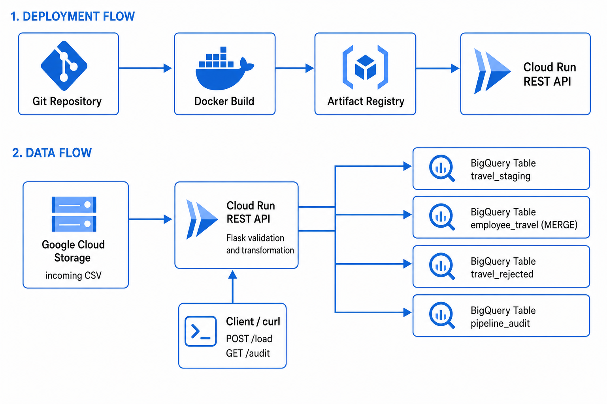

# GCP Travel Data Ingestion Platform

Portfolio-ready Google Cloud pipeline that reads employee travel bookings from **Cloud Storage**, validates and transforms them in a **Cloud Run** Flask API, and loads trusted facts into **BigQuery** with an idempotent `MERGE`, a rejected-records table, and an execution audit log.

This project is designed as a practical Udemy / GitHub demonstration: real GCP services, least-privilege IAM, **Application Default Credentials (ADC)** locally, and a **runtime service account** on Cloud Run. **No service-account key JSON is created, downloaded, or used.**



The checked-in diagram shows both deployment and data flow. See [docs/architecture.md](docs/architecture.md) for editable Mermaid versions and deeper design notes.

---

## Table of contents

1. [Project overview](#project-overview)
2. [Business problem](#business-problem)
3. [Dataset](#dataset)
4. [Folder structure](#folder-structure)
5. [Prerequisites](#prerequisites)
6. [GCP setup](#gcp-setup)
7. [Local run (ADC)](#local-run-using-adc)
8. [Local Flask test](#local-flask-test)
9. [Docker build, run, and test](#docker-build-run-and-test)
10. [Artifact Registry](#artifact-registry)
11. [Cloud Run deploy](#cloud-run-deploy)
12. [Trigger the pipeline](#exact-curlexe-trigger)
13. [API endpoints](#api-endpoints)
14. [BigQuery verification](#bigquery-verification)
15. [Idempotency](#idempotency)
16. [Logging, audit, and errors](#logging-audit-and-errors)
17. [Troubleshooting](#troubleshooting)
18. [Cleanup](#cleanup)
19. [Screenshot placeholders](#screenshot-placeholders)
20. [Interview questions](#interview-questions-15)

Deeper material:

- [docs/teacher-guide.md](docs/teacher-guide.md) — step-by-step classroom script (say / show / do / check).
- [docs/architecture.md](docs/architecture.md) — deployment and data flows, components, validation order, security.
- [docs/deployment-guide.md](docs/deployment-guide.md) — Console + CLI walkthrough, IAM roles, verification.
- [docs/ci-cd.md](docs/ci-cd.md) — automate deployment after the first manual deploy (Cloud Build trigger or keyless GitHub Actions).

---

## Project overview

| Layer | Choice | Role |
| --- | --- | --- |
| Source | GCS object `incoming/employee_travel.csv` | Landing zone for the 1,000-row booking file |
| Compute | Flask 3 + Gunicorn on Cloud Run (`PORT=8080`) | HTTP API: health, load, audit |
| Warehouse | BigQuery dataset `travel_analytics` | Staging, final, rejected, audit tables |
| Identity | ADC locally; Cloud Run attached service account | No JSON keys |
| Packaging | `python:3.11-slim` image in Artifact Registry | Repeatable deploys via `scripts/deploy.ps1` |

Request body for a load:

```json
{
  "bucket": "YOUR_BUCKET_NAME",
  "file": "incoming/employee_travel.csv"
}
```

Pipeline steps inside `POST /load`:

1. Download and parse the CSV from GCS (all columns as strings).
2. **Validate** (schema + data-quality rules) → split valid vs rejected.
3. **Transform** valid rows (trim, title-case names/cities, uppercase status/currency, `travel_duration_days`, lineage).
4. Append valid rows to `travel_staging`, **MERGE** into `employee_travel` on `booking_id`, append rejects to `travel_rejected`.
5. Write one row to `pipeline_audit` (`SUCCESS` or `FAILED`).

---

## Business problem

Finance and people-ops teams need a **trusted travel fact table** for spend, airline mix, and booking status. Source CSVs arrive with mixed case, padding, invalid dates, zero prices, missing IDs, and duplicate booking IDs.

A naive BigQuery load would mix bad rows into reports and create duplicates on replay. This API:

- Rejects bad rows with explicit reasons instead of failing the whole file (unless the file/schema is unusable).
- Upserts the business key `booking_id` so re-running the same file updates rows rather than duplicating them.
- Records every run so you can prove what loaded, what was rejected, and what failed.

---

## Dataset

File: [`data/employee_travel.csv`](data/employee_travel.csv) — **1,000 data rows** plus a header.

### Daily timestamped files (production naming)

Real drops arrive daily as `employee_travel_YYYYMMDD.csv`. Three ready-made samples (300 rows each, ~14 rejected / ~286 valid, distinct `booking_id` ranges per day) live in [`data/incoming/`](data/incoming/):

- `employee_travel_20260907.csv`
- `employee_travel_20260908.csv`
- `employee_travel_20260909.csv`

Regenerate or add more days with the deterministic generator:

```bash
# Default: 3 files starting 2026-09-07, 300 rows each
python scripts/generate_sample_data.py

# Custom dates / size
python scripts/generate_sample_data.py --dates 20260910 20260911 --rows 500
```

The API accepts any object path, so no code change is needed — just point `file` at the dated object, e.g. `incoming/employee_travel_20260908.csv`. The chosen name is recorded in the `source_file` lineage column and in `pipeline_audit.file_name`.

| Column | Description |
| --- | --- |
| `booking_id` | Business key (`BKG…`) |
| `employee_id`, `employee_name`, `department` | Traveler |
| `origin_city`, `destination_city` | Route |
| `travel_date`, `return_date` | Trip window |
| `travel_type` | Domestic / International |
| `airline` | Carrier |
| `ticket_price`, `currency` | Fare |
| `booking_status` | `CONFIRMED`, `PENDING`, `CANCELLED` |

**Intentional defects** (so validation is demonstrable, not theoretical):

| Defect | Approximate volume | Validator behavior |
| --- | --- | --- |
| Duplicate `booking_id` (`BKG000101`–`BKG000105`, second occurrence) | 5 rows | Reject: `duplicate booking_id in source file` (first occurrence can still load) |
| Missing `employee_id` | 5 | Reject |
| Missing `employee_name` | 5 | Reject |
| `ticket_price` not greater than zero / non-numeric | 5 | Reject |
| Invalid `travel_date` | 5 | Reject |
| `return_date` earlier than `travel_date` | 5 | Reject |
| Invalid `booking_status` (for example `APPROVED`) | 5 | Reject |
| Mixed / padded names and cities, mixed-case currency and status | Many valid rows | **Not rejected** — cleaned in transform (`str.title()`, `.upper()`, trim) |

Expected split with the current file: **965 valid**, **35 rejected**. Exact counts can differ slightly if you change the CSV; always confirm with `sql/validation_queries.sql`.

---

## Folder structure

```text
gcp-travel-data-ingestion/
├── app.py                      # Flask factory: GET /, GET /audit, POST /load
├── Dockerfile                  # Python 3.11-slim, non-root user, gunicorn
├── .dockerignore
├── .env.example                 # Variable names only; copy locally, never commit secrets
├── .gitignore
├── requirements.txt
├── README.md
├── cloudbuild.yaml             # CI/CD: build → push → deploy to Cloud Run
├── .github/
│   └── workflows/
│       └── deploy.yml          # Keyless GitHub Actions deploy (Workload Identity)
├── data/
│   ├── employee_travel.csv    # 1000-row source (upload to GCS; not copied into the image)
│   └── incoming/               # Daily timestamped samples (employee_travel_YYYYMMDD.csv)
├── docs/
│   ├── architecture.md
│   ├── ci-cd.md                # Automate deployment (Cloud Build trigger / GitHub Actions)
│   ├── deployment-guide.md
│   └── teacher-guide.md        # Classroom / Udemy walkthrough
├── images/
│   └── architecture.png       # Portfolio architecture image
├── scripts/
│   ├── deploy.ps1              # Git pull → build → tag → push → Cloud Run → curl.exe
│   ├── generate_sample_data.py # Generate timestamped daily CSV files
│   ├── test_api.ps1            # Health, load, audit against a service URL
│   └── sample_request.json     # bucket + file payload
├── sql/
│   ├── create_dataset.sql
│   ├── create_tables.sql
│   ├── merge_employee_travel.sql
│   └── validation_queries.sql
└── src/
    ├── __init__.py
    ├── config.py               # Env-only config (GCP_PROJECT_ID, BQ_DATASET, …)
    ├── gcs_reader.py
    ├── validator.py
    ├── transformer.py
    ├── bigquery_loader.py      # Staging load, MERGE, rejected load, audit query
    ├── audit.py
    ├── logger.py
    └── utils.py                # PipelineError types, timestamps
```

The Docker image copies **only** `app.py`, `src/`, and `requirements.txt`. CSV and SQL stay outside the container: upload data to GCS and run SQL in BigQuery yourself.

---

## Prerequisites

- Google Cloud project with billing enabled
- Roles on **your user** sufficient to enable APIs, create buckets/datasets, create a service account, and deploy Cloud Run (for example Project Owner on a sandbox, or a tighter custom set)
- [Google Cloud SDK](https://cloud.google.com/sdk) (`gcloud`, `gsutil`, `bq`)
- Python 3.11+ (local run)
- Docker Desktop
- PowerShell 7+ recommended on Windows (`curl.exe` not the `curl` alias)

Placeholders used everywhere (replace them; do not commit real IDs):

| Placeholder | Meaning |
| --- | --- |
| `YOUR_GCP_PROJECT_ID` | GCP project |
| `YOUR_BUCKET_NAME` | Globally unique bucket |
| `YOUR_REGION` | Cloud Run / Artifact Registry region, e.g. `us-central1` |
| `YOUR_CLOUD_RUN_URL` | `https://….run.app` |

---

## GCP setup

Commands below are **PowerShell**. `gcloud` itself is the same on macOS/Linux.

### 1. Sign in and select the project

```powershell
gcloud auth login
gcloud config set project YOUR_GCP_PROJECT_ID
gcloud config set compute/region YOUR_REGION
```

### 2. Enable APIs

```powershell
gcloud services enable `
  run.googleapis.com `
  artifactregistry.googleapis.com `
  storage.googleapis.com `
  bigquery.googleapis.com `
  iam.googleapis.com `
  cloudbuild.googleapis.com
```

> **Screenshot placeholder:** APIs & Services → Enabled APIs (`images/screenshots/enabled-apis.png`).

### 3. Create the bucket and upload the CSV

```powershell
gcloud storage buckets create gs://YOUR_BUCKET_NAME `
  --project=YOUR_GCP_PROJECT_ID `
  --location=US `
  --uniform-bucket-level-access

gcloud storage cp data/employee_travel.csv `
  gs://YOUR_BUCKET_NAME/incoming/employee_travel.csv
```

(`gsutil mb` / `gsutil cp` are equivalent if you prefer them.)

> **Screenshot placeholder:** Cloud Storage object `incoming/employee_travel.csv` (`images/screenshots/gcs-object.png`).

### 4. Create the BigQuery dataset and tables

```powershell
bq query --use_legacy_sql=false --project_id=YOUR_GCP_PROJECT_ID `
  (Get-Content .\sql\create_dataset.sql -Raw)

bq query --use_legacy_sql=false --project_id=YOUR_GCP_PROJECT_ID `
  (Get-Content .\sql\create_tables.sql -Raw)
```

Creates dataset `travel_analytics` (US) and tables:

| Table | Purpose |
| --- | --- |
| `travel_staging` | Valid rows for one execution (append; 30-day partition expiry) |
| `employee_travel` | Trusted facts (MERGE target) |
| `travel_rejected` | Invalid rows + `rejection_reason` |
| `pipeline_audit` | One row per API execution |

> **Screenshot placeholder:** BigQuery Explorer showing the four tables (`images/screenshots/bq-tables.png`).

### 5. Runtime service account and IAM (no JSON keys)

```powershell
gcloud iam service-accounts create travel-ingestion-sa `
  --project=YOUR_GCP_PROJECT_ID `
  --display-name="Travel ingestion Cloud Run SA"

$Sa = "serviceAccount:travel-ingestion-sa@YOUR_GCP_PROJECT_ID.iam.gserviceaccount.com"

gcloud projects add-iam-policy-binding YOUR_GCP_PROJECT_ID `
  --member=$Sa --role="roles/storage.objectViewer"

gcloud projects add-iam-policy-binding YOUR_GCP_PROJECT_ID `
  --member=$Sa --role="roles/bigquery.dataEditor"

gcloud projects add-iam-policy-binding YOUR_GCP_PROJECT_ID `
  --member=$Sa --role="roles/bigquery.jobUser"
```

| Role | Why |
| --- | --- |
| **Storage Object Viewer** (`roles/storage.objectViewer`) | Download the CSV blob |
| **BigQuery Data Editor** (`roles/bigquery.dataEditor`) | Load staging/rejected, stream audit inserts, MERGE into the final table |
| **BigQuery Job User** (`roles/bigquery.jobUser`) | Run load and query jobs in the project |

Attach this account to Cloud Run (`--service-account`). **Do not** run `gcloud iam service-accounts keys create`. Local development uses `gcloud auth application-default login` only.

> **Screenshot placeholder:** IAM bindings for `travel-ingestion-sa` (`images/screenshots/iam-sa.png`).

---

## Local run using ADC

`src/config.py` reads environment variables only. The app does **not** call `load_dotenv()`; set variables in the shell (you can copy names from `.env.example`).

```powershell
python -m venv .venv
.\.venv\Scripts\Activate.ps1
pip install -r requirements.txt

gcloud auth application-default login
gcloud auth application-default set-quota-project YOUR_GCP_PROJECT_ID

$env:GCP_PROJECT_ID = "YOUR_GCP_PROJECT_ID"
$env:GOOGLE_CLOUD_PROJECT = "YOUR_GCP_PROJECT_ID"
$env:BQ_DATASET = "travel_analytics"
$env:BQ_LOCATION = "US"
$env:PORT = "8080"
$env:LOG_LEVEL = "INFO"

python app.py
```

ADC user credentials must be allowed to read the bucket and write BigQuery (your user, or a group). Still **no key file**.

---

## Local Flask test

```powershell
curl.exe http://localhost:8080/

curl.exe -X POST http://localhost:8080/load `
  -H "Content-Type: application/json" `
  --data-binary "@scripts/sample_request.json"
```

Edit `scripts/sample_request.json` so `bucket` is `YOUR_BUCKET_NAME` (file path stays `incoming/employee_travel.csv`).

```powershell
curl.exe "http://localhost:8080/audit?limit=5"
```

---

## Docker build, run, and test

```powershell
docker build -t travel-ingestion-api:v1 .
```

Local container + ADC (Windows). This mounts the **ADC directory**, not a service-account key:

```powershell
docker run --rm -p 8080:8080 `
  -e GCP_PROJECT_ID=YOUR_GCP_PROJECT_ID `
  -e GOOGLE_CLOUD_PROJECT=YOUR_GCP_PROJECT_ID `
  -e BQ_DATASET=travel_analytics `
  -e BQ_LOCATION=US `
  -e GOOGLE_APPLICATION_CREDENTIALS=/adc/application_default_credentials.json `
  -v "${env:APPDATA}\gcloud:/adc:ro" `
  travel-ingestion-api:v1
```

macOS/Linux equivalent mount: `$HOME/.config/gcloud:/adc:ro`.

```powershell
curl.exe http://localhost:8080/
curl.exe -X POST http://localhost:8080/load `
  -H "Content-Type: application/json" `
  --data-binary "@scripts/sample_request.json"
```

---

## Artifact Registry

```powershell
gcloud artifacts repositories create travel-platform `
  --repository-format=docker `
  --location=YOUR_REGION `
  --description="Travel ingestion images"

gcloud auth configure-docker "YOUR_REGION-docker.pkg.dev"

docker build -t travel-ingestion-api:v1 .

docker tag travel-ingestion-api:v1 `
  YOUR_REGION-docker.pkg.dev/YOUR_GCP_PROJECT_ID/travel-platform/travel-ingestion-api:v1

docker push `
  YOUR_REGION-docker.pkg.dev/YOUR_GCP_PROJECT_ID/travel-platform/travel-ingestion-api:v1
```

> **Screenshot placeholder:** Artifact Registry repository and image digest (`images/screenshots/artifact-registry.png`).

---

## Cloud Run deploy

**Unauthenticated access is for this public demo only** (`--allow-unauthenticated` grants `allUsers` the Cloud Run Invoker role). A production service should use `--no-allow-unauthenticated` and grant Invoker only to callers you trust.

```powershell
gcloud run deploy travel-ingestion-api `
  --project YOUR_GCP_PROJECT_ID `
  --region YOUR_REGION `
  --image YOUR_REGION-docker.pkg.dev/YOUR_GCP_PROJECT_ID/travel-platform/travel-ingestion-api:v1 `
  --service-account travel-ingestion-sa@YOUR_GCP_PROJECT_ID.iam.gserviceaccount.com `
  --set-env-vars "GCP_PROJECT_ID=YOUR_GCP_PROJECT_ID,BQ_DATASET=travel_analytics,BQ_LOCATION=US,LOG_LEVEL=INFO" `
  --allow-unauthenticated `
  --platform managed
```

```powershell
gcloud run services describe travel-ingestion-api `
  --project YOUR_GCP_PROJECT_ID `
  --region YOUR_REGION `
  --format "value(status.url)"
```

`scripts/deploy.ps1` automates git pull → build → tag → push → deploy → `curl.exe` after you replace `YOUR_*` values at the top of the script.

> **Screenshot placeholder:** Cloud Run service, image, SA, env vars (`images/screenshots/cloud-run-service.png`).

---

## Exact curl.exe trigger

Use **`curl.exe`** on Windows so PowerShell does not invoke `Invoke-WebRequest`.

```powershell
curl.exe -X POST "YOUR_CLOUD_RUN_URL/load" `
  -H "Content-Type: application/json" `
  --data-binary "@scripts/sample_request.json"
```

Inline JSON (PowerShell-safe quoting):

```powershell
curl.exe -X POST "YOUR_CLOUD_RUN_URL/load" `
  -H "Content-Type: application/json" `
  -d "{\"bucket\":\"YOUR_BUCKET_NAME\",\"file\":\"incoming/employee_travel.csv\"}"
```

Health and audit:

```powershell
curl.exe "YOUR_CLOUD_RUN_URL/"
curl.exe "YOUR_CLOUD_RUN_URL/audit?limit=5"
```

Or: `.\scripts\test_api.ps1 -ServiceUrl "YOUR_CLOUD_RUN_URL"`.

---

## API endpoints

Base URL: `http://localhost:8080` or `YOUR_CLOUD_RUN_URL`.

### `GET /`

Liveness only; does not call GCS or BigQuery.

**Success (200)**

```json
{
  "service": "gcp-travel-data-ingestion",
  "status": "UP",
  "version": "1.0.0"
}
```

### `POST /load`

JSON object required. `file` must end with `.csv`.

**Success (200)**

```json
{
  "status": "SUCCESS",
  "execution_id": "3f2c1a90-1111-2222-3333-444455556666",
  "records_read": 1000,
  "records_loaded": 965,
  "records_rejected": 35,
  "processing_time": "4.12 seconds"
}
```

**Failure examples**

| HTTP | When | Body (shape) |
| --- | --- | --- |
| 400 | Missing JSON, empty `bucket`/`file`, non-CSV `file` | `{"status":"FAILED","execution_id":"…","message":"'bucket' is required"}` |
| 403 | GCS or BigQuery permission denied | `{"status":"FAILED",…,"message":"GCS permission denied while reading source file"}` |
| 404 | Object missing | `{"status":"FAILED",…,"message":"GCS object not found: gs://…"}` |
| 422 | Empty file, parse error, missing required columns | `{"status":"FAILED",…,"message":"The CSV file is empty"}` |
| 500 | Unexpected error or missing BigQuery tables | `{"status":"FAILED",…,"message":"Unexpected server error"}` |

If a BigQuery client was already created, a **FAILED** audit row is written when possible.

### `GET /audit`

Query: `limit` (default 20, max 100).

**Success (200)**

```json
{
  "status": "SUCCESS",
  "executions": [
    {
      "execution_id": "3f2c1a90-1111-2222-3333-444455556666",
      "file_name": "incoming/employee_travel.csv",
      "status": "SUCCESS",
      "records_read": 1000,
      "records_loaded": 965,
      "records_rejected": 35
    }
  ]
}
```

---

## BigQuery verification

Run the numbered queries in [`sql/validation_queries.sql`](sql/validation_queries.sql) (Console or `bq query`). Highlights:

```sql
-- 1. Total loaded records
SELECT COUNT(*) AS total_loaded FROM `travel_analytics.employee_travel`;

-- 2. Duplicate booking IDs (expected: zero rows)
SELECT booking_id, COUNT(*) AS occurrences
FROM `travel_analytics.employee_travel`
GROUP BY booking_id HAVING COUNT(*) > 1;

-- 3. Rejected records by reason
SELECT rejection_reason, COUNT(*) AS rejected_count
FROM `travel_analytics.travel_rejected`
GROUP BY rejection_reason ORDER BY rejected_count DESC;

-- 9. Pipeline audit history
SELECT * FROM `travel_analytics.pipeline_audit` ORDER BY start_time DESC;
```

After a successful first load of the sample file, expect ~965 rows in `employee_travel`, 35 in `travel_rejected` for that `execution_id`, and **zero** duplicate `booking_id` values in the final table. Re-run `POST /load`: final-table count stays the same; `pipeline_audit` gains another `SUCCESS` row; staging and rejected **append**.

---

## Idempotency

- **Business key:** `booking_id`.
- Valid rows are appended to `travel_staging` with a unique `execution_id`.
- `MERGE` (in code and `sql/merge_employee_travel.sql`) takes that execution’s staging rows, dedupes with `ROW_NUMBER()` by `booking_id` (`processed_at DESC`), then `WHEN MATCHED THEN UPDATE` / `WHEN NOT MATCHED THEN INSERT`.
- Replaying the same CSV **updates** existing facts (lineage `execution_id` / `processed_at` / `source_file` change) and does **not** insert a second final row.
- In-file duplicates: the **first** `booking_id` can validate; later copies are rejected.
- `travel_rejected` and `pipeline_audit` are **append-only** (replay adds history, not a second final booking).

---

## Logging, audit, and errors

- Logs go to **stdout** as `timestamp LEVEL name execution_id=… message` (`src/logger.py`). Cloud Run ships them to Cloud Logging.
- Each `/load` generates a UUID `execution_id` used in logs, staging, rejected, and audit.
- Success and handled failures write `pipeline_audit` (`status` `SUCCESS` or `FAILED`, optional `error_message` truncated to 1024 characters).
- Expected errors map to HTTP 400/403/404/422 via `PipelineError`. Unexpected exceptions return 500 without leaking internals.
- If audit insert itself fails after a pipeline error, the API still returns `FAILED` and logs `Unable to persist failure audit`.

---

## Troubleshooting

| Symptom | What to check |
| --- | --- |
| 403 GCS or BigQuery | SA has Object Viewer + Data Editor + Job User; ADC user has access locally |
| 404 GCS | Bucket name and object `incoming/employee_travel.csv` |
| 500 “dataset or table not found” | Run `sql/create_dataset.sql` and `sql/create_tables.sql` |
| 400 `'file' must reference a CSV` | Object name must end with `.csv` |
| Docker cannot see ADC | Mount ADC dir; `GOOGLE_APPLICATION_CREDENTIALS` points at `application_default_credentials.json` |
| PowerShell `curl` weirdness | Use `curl.exe` |
| Cloud Run timeout | Large CSV / cold start; Gunicorn `--timeout 0` lets Cloud Run request timeout govern |
| Image push denied | `gcloud auth configure-docker YOUR_REGION-docker.pkg.dev` and Artifact Registry Writer on your user |

---

## Cleanup

```powershell
gcloud run services delete travel-ingestion-api --region YOUR_REGION --project YOUR_GCP_PROJECT_ID --quiet
gcloud artifacts repositories delete travel-platform --location YOUR_REGION --project YOUR_GCP_PROJECT_ID --quiet
gcloud storage rm -r gs://YOUR_BUCKET_NAME
bq rm -r -f -d YOUR_GCP_PROJECT_ID:travel_analytics
gcloud iam service-accounts delete `
  travel-ingestion-sa@YOUR_GCP_PROJECT_ID.iam.gserviceaccount.com `
  --project YOUR_GCP_PROJECT_ID --quiet
```

Optionally disable unused APIs. This does not delete the GCP project.

---

## Screenshot placeholders

Add files under `images/screenshots/` (or paste into the Udemy lecture):

| File | Capture |
| --- | --- |
| `images/architecture.png` | End-to-end architecture |
| `images/screenshots/enabled-apis.png` | Enabled Google APIs |
| `images/screenshots/gcs-object.png` | CSV in GCS |
| `images/screenshots/bq-tables.png` | Four BigQuery tables |
| `images/screenshots/iam-sa.png` | Runtime SA roles |
| `images/screenshots/artifact-registry.png` | Pushed image |
| `images/screenshots/cloud-run-service.png` | Cloud Run revision + URL |
| `images/screenshots/curl-success.png` | `curl.exe` SUCCESS JSON |
| `images/screenshots/bq-validation.png` | Validation query results |
| `images/screenshots/cloud-logging.png` | Logs with `execution_id` |

---

## Interview questions (15)

**1. Why Cloud Run + GCS + BigQuery instead of a single BigQuery load job?**  
Cloud Run gives an HTTP contract, validation, and audit in application code. GCS is the landing zone; BigQuery is the warehouse. You can reject rows, MERGE on a key, and expose `/audit` without scheduling a brittle load job alone.

**2. Why not a service-account JSON key on the laptop or in the image?**  
Keys are long-lived secrets that leak via Git and Docker layers. This project uses **ADC** locally (`gcloud auth application-default login`) and the **Cloud Run attached service account** in GCP. No `keys create`, no `GOOGLE_APPLICATION_CREDENTIALS` pointing at a downloaded SA key.

**3. What does Storage Object Viewer vs BigQuery Data Editor vs BigQuery Job User each allow?**  
Object Viewer: `objects.get` on the CSV. Data Editor: insert/load/update table data (staging, MERGE, rejected, audit). Job User: create BigQuery jobs in the project. All three are required for this API’s runtime SA.

**4. Why validate before transform?**  
Quality rules run on raw strings (missing IDs, bad dates, non-positive prices, invalid status). Transform then standardizes only valid rows (title case, duration, lineage). Transforming first could hide defects or compute duration on invalid dates.

**5. How is the pipeline idempotent?**  
`MERGE employee_travel` on `booking_id` for the current `execution_id` staging set. Replays update; they do not insert a second fact. `ROW_NUMBER()` guards a bad staging batch with duplicate keys.

**6. Why a staging table instead of merging a DataFrame directly?**  
Staging is an append-only, execution-scoped source the SQL `MERGE` can query with parameters, partition expiry (30 days), and the same logic as `sql/merge_employee_travel.sql`. It is easier to debug than an in-memory-only upsert.

**7. Why keep rejected rows instead of failing the whole file?**  
Most bookings are usable. Quarantine preserves original values plus `rejection_reason` for data owners. Schema/empty/parse failures still fail the run (HTTP 422) because there is no trustworthy batch.

**8. What does `pipeline_audit` prove in an interview?**  
Each execution’s file, timing, counts, and success/failure. You can join `execution_id` to staging/rejected and to Cloud Logging.

**9. Why read CSV as `dtype=str` with NA filters off?**  
So blanks stay empty strings and numeric/date coercion happens in the validator, where reasons are explicit, rather than pandas silently turning values into NaN.

**10. Why partition and cluster these tables?**  
Staging/rejected/audit partition on date for cheap time scans and staging TTL. `employee_travel` partitions on `travel_date` and clusters by `department`, `booking_status`, `booking_id` for the validation/spend queries.

**11. Why Gunicorn `--timeout 0` and Cloud Run `--allow-unauthenticated`?**  
Timeout 0 defers to Cloud Run’s request timeout for a 1000-row load. Unauthenticated Invoker is a **demo** shortcut so `curl.exe` works without an identity token. Production should require auth.

**12. How do you trigger a private Cloud Run service instead?**  
Deploy `--no-allow-unauthenticated`, then `gcloud auth print-identity-token` and `curl.exe -H "Authorization: Bearer TOKEN"`.

**13. What happens on a second POST of the same file?**  
New `execution_id`; ~965 staging rows appended; MERGE updates 965 keys; ~35 new rejected rows; new SUCCESS audit. `COUNT(*)` on `employee_travel` stays ~965; duplicate-key query still returns zero.

**14. How would you harden this for production?**  
Authenticated Cloud Run, VPC-SC or private GCS, tighter IAM (dataset-level not project-wide Data Editor if possible), request validation/WAF, alerts on FAILED audits, dead-letter for poison files, and CI that builds/pushes without human Docker on a laptop.

**15. Cloud Run vs Cloud Functions vs Dataflow for this use case?**  
Functions fit tiny single-purpose triggers; Dataflow fits large/streaming/batch with autoscaling workers. Cloud Run fits a small containerized API, custom pandas validation, and a portfolio-sized 1k-row file with a clear HTTP demo.

---

## License / usage

Use as a learning and portfolio project. Replace every `YOUR_*` placeholder before running commands. Never commit `.env`, ADC files, or service-account keys.
