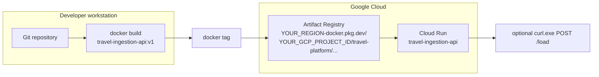
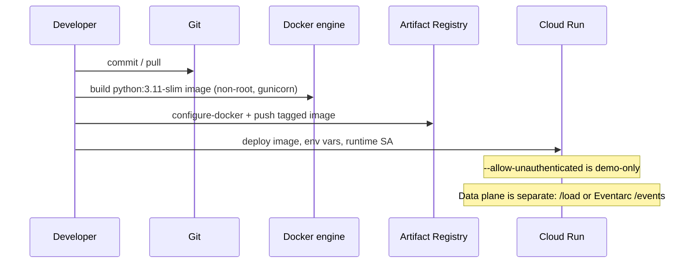
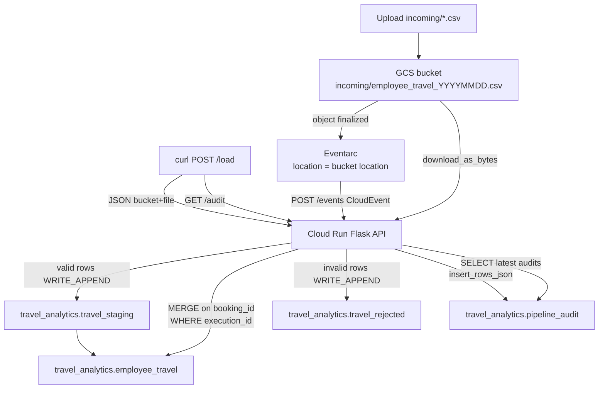
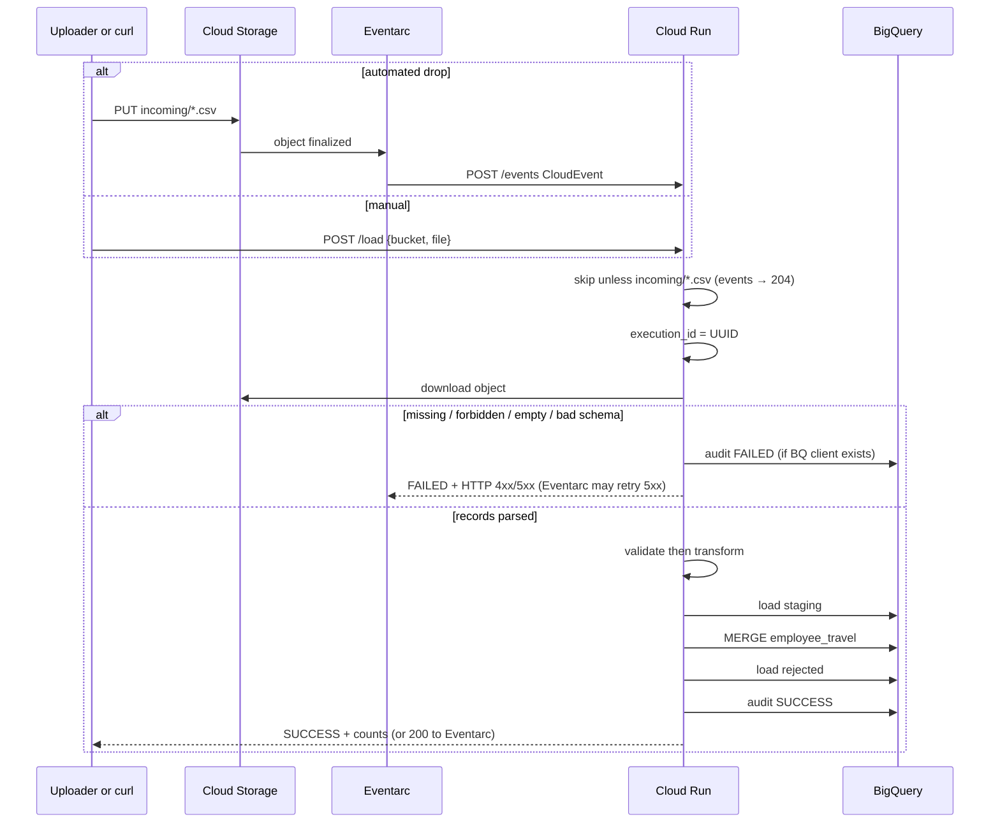

# Architecture

This document describes how the GCP Travel Data Ingestion Platform is **deployed** and how **data** moves from a CSV in Cloud Storage to curated BigQuery tables. Implementation details match `app.py`, `src/` (including `gcs_event.py`), `Dockerfile`, `sql/`, `cloudbuild.yaml`, and Eventarc wiring in [eventarc.md](eventarc.md).

There are **two planes**. They must not be collapsed into one arrow on the whiteboard.

| Plane | Trigger | What changes |
| --- | --- | --- |
| **Deploy** | `git push` / Cloud Build / `gcloud run deploy` | New Cloud Run *revision* (container). Does not read CSVs. |
| **Data** | `POST /load` **or** Eventarc `POST /events` | One GCS object → validate → BigQuery. Does not rebuild the image. |

**Identity:** local runs use Application Default Credentials (ADC). Cloud Run uses `travel-ingestion-sa`. Eventarc invokes Cloud Run as `travel-eventarc-sa`. **No service-account key JSON is used.**

---

## Deployment flow: Git → Docker → Artifact Registry → Cloud Run

Developers commit the Flask app (`app.py`, `src/`, `requirements.txt`, `Dockerfile`). A deploy builds a local image, tags it for Artifact Registry, pushes the digest, and points a Cloud Run service at that image with environment variables and a dedicated service account.

`scripts/deploy.ps1` encodes this path: `git pull` → `docker build` → `docker tag` → `docker push` → `gcloud run deploy` → `curl.exe` against `/load`.

Eventarc is **not** on this diagram. A new image does not load yesterday's CSV.

**Image contents:** `Dockerfile` copies `requirements.txt`, `app.py`, and `src/` only. It does not bake in `data/` or `sql/`. The CSV must already exist in GCS; tables must already exist in BigQuery.

**Runtime process:** `gunicorn --bind :${PORT:-8080} --workers 2 --threads 8 --timeout 0 app:app`. Cloud Run injects `PORT`. Config (`GCP_PROJECT_ID`, `BQ_DATASET`, `BQ_LOCATION`, `LOG_LEVEL`) comes from `--set-env-vars`, not from files in the image.

---

## Data flow: GCS → Cloud Run → BigQuery

Two equivalent entry points share `run_pipeline` in `app.py`:

1. **Manual** — `POST /load` JSON `{ "bucket", "file" }` (classroom curl, replays).
2. **Automated** — GCS **object finalized** → Eventarc → `POST /events` CloudEvent. The API keeps only `incoming/*.csv` (HTTP **204** otherwise). Files already in the folder are **not** listed or scanned.

Both download the object, validate, transform, then write four BigQuery surfaces: staging (append), final (`MERGE`), rejected (append), audit (streaming insert).

**Trigger location must equal bucket location.** A **US multi-region** bucket (this project's landing zone) uses Eventarc location **`us`**. Cloud Run can stay in `us-central1`. A `us-central1` Eventarc trigger will not see that bucket.

---

## Component responsibilities

| Component | Responsibility |
| --- | --- |
| **GCS** | Durable landing zone. Daily objects `incoming/employee_travel_YYYYMMDD.csv`. Eventarc does not list the prefix. |
| **Eventarc** | GCS object-finalized → `POST /events`. One event per new or overwritten object. Location = bucket location (`us` for US multi-region). Path-pattern `name=incoming/*.csv` is **not** supported on this event type; the API filters. Delivery is **at-least-once** (duplicate audits possible; MERGE still unique on `booking_id`). |
| **`src/gcs_event.py`** | Parse CloudEvent; keep `incoming/*.csv` only. Other objects → **204** (no audit, no retry). |
| **`src/gcs_reader.py`** | `download_as_bytes`, parse with pandas (`dtype=str`, no NA filter). Maps `NotFound` → 404, `Forbidden` → 403, empty/parse errors → 422. |
| **`src/validator.py`** | Requires 13 columns. Splits valid vs rejected with concatenated `rejection_reason` values. |
| **`src/transformer.py`** | Trim; title-case name/cities; uppercase status/currency; `travel_duration_days`; lineage `processed_at`, `source_file`, `execution_id`. |
| **`src/bigquery_loader.py`** | Staging load job, parameterized `MERGE`, rejected load job, parameterized audit `SELECT`. |
| **`src/audit.py`** | One `AuditRecord` per execution via `insert_rows_json`. |
| **`src/config.py`** | Frozen dataclass from env: `GCP_PROJECT_ID` / `GOOGLE_CLOUD_PROJECT`, dataset, location, table names, port, log level, audit limit. |
| **`app.py`** | Health (no GCP), `/load` (manual JSON), `/events` (Eventarc CloudEvent), `/audit`, JSON error envelope. Shared `run_pipeline`. |
| **BigQuery** | `travel_staging` (partition `DATE(processed_at)`, cluster `execution_id, booking_id`, 30-day partition expiry), `employee_travel` (partition `travel_date`, cluster `department, booking_status, booking_id`), `travel_rejected`, `pipeline_audit`. |
| **Cloud Logging** | Receives stdout; each pipeline logger is bound to `execution_id`. |
| **IAM** | Runtime SA: Storage Object Viewer, BigQuery Data Editor, BigQuery Job User. Eventarc SA: Eventarc Event Receiver, Cloud Run Invoker, Storage Legacy Bucket Reader on the landing bucket (`storage.buckets.get`). GCS project SA: Pub/Sub Publisher. Eventarc service agent: `roles/eventarc.serviceAgent`. |

---

## Validation, transform, and load order

Order is **read → validate → transform → load**. It is not transform-first and not a single BigQuery `LOAD` with autodetect.

1. **Read** — Preserve raw strings so “blank” vs “0” vs “APPROVED” stay distinguishable.
2. **Validate** — Fail the whole run only for unusable files (missing-column schema, empty file, parse error — all raised as `ValueError` → HTTP 422). Otherwise row-level rules:
   - `booking_id` / `employee_id` / `employee_name` present
   - duplicate `booking_id` in file (keep first)
   - `ticket_price` numeric and `> 0`
   - parseable `travel_date` / `return_date`
   - `return_date >= travel_date`
   - `booking_status` in `CONFIRMED`, `PENDING`, `CANCELLED` (case-insensitive via `.upper()`)
3. **Transform valid** — Standardization and `travel_duration_days` only on rows that already have real dates and prices.
4. **Transform rejected** — Trim + lineage (`rejection_reason` kept); dates/prices stored as **STRING** in `travel_rejected` so invalid values survive.
5. **Load** — Staging → MERGE final → rejected. Audit last so counts match what was attempted.

Mixed-case cities, padded names, and `usd` / `confirmed` are **valid**; transform cleans them. That is why the 1,000-row file can contain messy-but-legal values plus ~35 true rejects.

---

## Idempotency

Idempotency is **at the booking grain**, not “exactly-once HTTP”.

- Each `POST /load` or accepted `POST /events` is a new `execution_id`. Staging always **appends**.
- `MERGE` uses only `WHERE execution_id = @execution_id`, so a replay does not re-merge older staging batches.
- `ON T.booking_id = S.booking_id` updates all non-key columns including lineage.
- `ROW_NUMBER() OVER (PARTITION BY booking_id ORDER BY processed_at DESC)` makes the USING clause unique on `booking_id` (BigQuery `MERGE` requires a unique key in source).
- HTTP retries and Eventarc **at-least-once** delivery converge the **final** table to the latest valid payload per `booking_id`.
- Rejected and audit tables are **not** idempotent; they are an operational history. Replays and duplicate events add rows there on purpose.

The standalone script `sql/merge_employee_travel.sql` is the same MERGE pattern for explanation or a manual rerun with `--parameter=execution_id:STRING:<UUID>`.

---

## Failure and audit behavior

| Failure | HTTP | Audit |
| --- | --- | --- |
| Eventarc event not `incoming/*.csv` | **204** | None (ignored) |
| Invalid JSON / missing bucket or file / non-CSV (`/load`) | 400 | Best-effort FAILED audit after initializing the BigQuery client |
| GCS not found | 404 | FAILED (client exists) |
| GCS / BQ permission | 403 | FAILED when BQ is available |
| Empty or unparsable CSV, missing columns | 422 | FAILED |
| Dataset/table missing | 500 | FAILED or error if audit table missing |
| Unexpected exception | 500, generic message | FAILED when BQ available; nested failure logged as `Unable to persist failure audit` |

Partial BigQuery work: staging load can succeed and MERGE fail; the FAILED audit still records `records_loaded` / `records_rejected` counted **in memory** before the failing call. Staging is not rolled back (no multi-statement transaction around load + MERGE). Operators use `execution_id` to inspect leftover staging. Partition expiration (30 days) limits staging growth.

`GET /` never writes audit and does not need GCP credentials (useful as a Cloud Run liveness probe).

---

## Security and production considerations

**What this demo does**

- Non-root container user `app`.
- Config from environment, not checked-in secrets.
- No SA key in Git, Docker context (`.dockerignore` excludes `.env`), or Cloud Run env.
- Least-privilege **data-plane** roles on the runtime SA (read objects, edit table data, run jobs).
- Separate **invoke-plane** SA for Eventarc (no BigQuery). Grant Cloud Run Invoker to that SA rather than relying only on `allUsers`.
- Parameterized BigQuery queries (`execution_id`, `limit`) rather than concatenating client strings into SQL for those filters.
- Request body allow-list on `/load`; CloudEvent filter on `/events` (`incoming/*.csv` only).

**What you should change before production**

- Replace `--allow-unauthenticated` with authenticated invokers (IAM `roles/run.invoker`) and identity tokens.
- Prefer dataset-level or table-level BigQuery IAM instead of project-wide Data Editor if other datasets exist.
- Restrict the GCS bucket with uniform access; do not make the CSV public.
- Set Cloud Run ingress (internal / HTTPS load balancer) if the API should not be on the public internet.
- Bind the runtime SA with `iam.serviceAccountUser` only for deployers who may attach it.
- Add organization policies denying SA key creation to match the “no JSON keys” design.
- Add alerting on `pipeline_audit.status = 'FAILED'` and on 4xx/5xx in Cloud Run metrics.
- Consider CMEK, VPC-SC, and CMEK-covered buckets/datasets in regulated environments.
- Do not log full CSV rows (current logs are counts and operational messages).

For Console/CLI steps, IAM rationale, and verification, see [deployment-guide.md](deployment-guide.md). For GCS → API automation, see [eventarc.md](eventarc.md).
