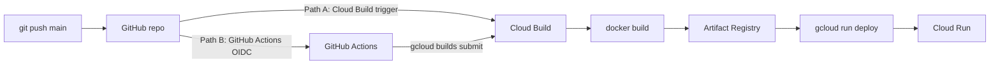

# Automated Deployment (CI/CD)

You have already deployed to Cloud Run **manually** (Console/Cloud Shell or `scripts/deploy.ps1`). This document shows how to **automate** that so every push to `main` rebuilds the image and redeploys — with **no service-account JSON keys**.

Two supported paths:

| Path | Trigger | Runs on | Best for |
| --- | --- | --- | --- |
| **A. Cloud Build trigger** | Push to GitHub (or Cloud Source Repos) | Google Cloud Build | Staying 100% inside GCP; simplest to teach |
| **B. GitHub Actions + WIF** | Push to `main` | GitHub-hosted runner | Teams standardized on GitHub Actions |

Both reuse the same [`cloudbuild.yaml`](../cloudbuild.yaml): **build → push to Artifact Registry → deploy to Cloud Run**. Manual deploy stays available as a fallback.



---

## Prerequisites (both paths)

Already created in earlier lessons:

- Artifact Registry repo (e.g. `travel-platform`). If you only ever used `gcloud run deploy --source .`, you may instead have a `cloud-run-source-deploy` repo — either works; set `_REPOSITORY` in `cloudbuild.yaml` accordingly.
- Runtime service account `travel-ingestion-sa@PROJECT_ID.iam.gserviceaccount.com` with Storage Object Viewer, BigQuery Data Editor, BigQuery Job User.
- APIs enabled: Cloud Run, Artifact Registry, Cloud Build, BigQuery, Storage, IAM.

Create the Artifact Registry repo if it does not exist:

```bash
gcloud artifacts repositories create travel-platform \
  --repository-format=docker \
  --location=us-central1 \
  --description="Travel ingestion images"
```

---

## Path A — Cloud Build trigger (recommended, all-GCP)

### A1. Grant the Cloud Build service account deploy rights

Cloud Build runs as a service account. On most projects it is either the
**default Cloud Build SA** (`PROJECT_NUMBER@cloudbuild.gserviceaccount.com`) or
the **default compute SA**. Grant it permission to deploy Cloud Run and to act
as the runtime SA:

```bash
PROJECT_ID=YOUR_PROJECT_ID
PROJECT_NUMBER=$(gcloud projects describe "$PROJECT_ID" --format='value(projectNumber)')
BUILD_SA="${PROJECT_NUMBER}@cloudbuild.gserviceaccount.com"

# Deploy Cloud Run services
gcloud projects add-iam-policy-binding "$PROJECT_ID" \
  --member="serviceAccount:${BUILD_SA}" --role="roles/run.admin"

# Push images to Artifact Registry
gcloud projects add-iam-policy-binding "$PROJECT_ID" \
  --member="serviceAccount:${BUILD_SA}" --role="roles/artifactregistry.writer"

# Act as the runtime SA that Cloud Run will use
gcloud iam service-accounts add-iam-policy-binding \
  "travel-ingestion-sa@${PROJECT_ID}.iam.gserviceaccount.com" \
  --member="serviceAccount:${BUILD_SA}" --role="roles/iam.serviceAccountUser"
```

> If your project uses a dedicated build SA or the compute SA, substitute that
> email for `BUILD_SA`. The three role grants are the same.

### A2. Create the trigger (Console)

1. **Cloud Build → Triggers → Connect repository** → choose **GitHub (Cloud Build GitHub App)** → authorize → select your repo.
2. **Create trigger**:
   - Event: **Push to a branch**
   - Branch: `^main$`
   - Configuration: **Cloud Build configuration file (yaml)** → `/cloudbuild.yaml`
   - Substitution: `_IMAGE_TAG` = `$SHORT_SHA` (so each deploy is tagged with the commit)
3. **Create**.

### A2 (CLI alternative)

```bash
gcloud builds triggers create github \
  --name=travel-ingestion-deploy \
  --repo-owner=YOUR_GITHUB_ORG \
  --repo-name=gcp-travel-data-ingestion \
  --branch-pattern='^main$' \
  --build-config=cloudbuild.yaml \
  --substitutions=_IMAGE_TAG=\$SHORT_SHA
```

### A3. Test it

```bash
git commit --allow-empty -m "ci: trigger deploy"
git push origin main
```

Watch **Cloud Build → History**. On success, **Cloud Run → Revisions** shows a new revision tagged with the commit SHA.

Run a build manually any time without pushing:

```bash
gcloud builds submit --config cloudbuild.yaml \
  --substitutions=_IMAGE_TAG=$(git rev-parse --short HEAD)
```

---

## Path B — GitHub Actions with Workload Identity Federation (keyless)

Use [`.github/workflows/deploy.yml`](../.github/workflows/deploy.yml). GitHub's
OIDC token is exchanged for short-lived Google credentials — **no JSON key** is
stored in GitHub secrets.

### B1. Create a deployer service account

```bash
PROJECT_ID=YOUR_PROJECT_ID

gcloud iam service-accounts create github-deployer \
  --project="$PROJECT_ID" \
  --display-name="GitHub Actions deployer"

DEPLOYER="github-deployer@${PROJECT_ID}.iam.gserviceaccount.com"

# Roles to build + deploy
gcloud projects add-iam-policy-binding "$PROJECT_ID" \
  --member="serviceAccount:${DEPLOYER}" --role="roles/cloudbuild.builds.editor"
gcloud projects add-iam-policy-binding "$PROJECT_ID" \
  --member="serviceAccount:${DEPLOYER}" --role="roles/run.admin"
gcloud projects add-iam-policy-binding "$PROJECT_ID" \
  --member="serviceAccount:${DEPLOYER}" --role="roles/artifactregistry.writer"
gcloud projects add-iam-policy-binding "$PROJECT_ID" \
  --member="serviceAccount:${DEPLOYER}" --role="roles/storage.admin"

# Deployer must act as the runtime SA and (for builds submit) as itself/build SA
gcloud iam service-accounts add-iam-policy-binding \
  "travel-ingestion-sa@${PROJECT_ID}.iam.gserviceaccount.com" \
  --member="serviceAccount:${DEPLOYER}" --role="roles/iam.serviceAccountUser"
```

### B2. Create the Workload Identity pool + provider

```bash
PROJECT_NUMBER=$(gcloud projects describe "$PROJECT_ID" --format='value(projectNumber)')
GITHUB_REPO="YOUR_GITHUB_ORG/gcp-travel-data-ingestion"

gcloud iam workload-identity-pools create github-pool \
  --project="$PROJECT_ID" --location=global \
  --display-name="GitHub Actions pool"

gcloud iam workload-identity-pools providers create-oidc github-provider \
  --project="$PROJECT_ID" --location=global \
  --workload-identity-pool=github-pool \
  --display-name="GitHub OIDC" \
  --issuer-uri="https://token.actions.githubusercontent.com" \
  --attribute-mapping="google.subject=assertion.sub,attribute.repository=assertion.repository" \
  --attribute-condition="assertion.repository=='${GITHUB_REPO}'"

# Allow only this repo to impersonate the deployer SA
gcloud iam service-accounts add-iam-policy-binding "$DEPLOYER" \
  --project="$PROJECT_ID" \
  --role="roles/iam.workloadIdentityUser" \
  --member="principalSet://iam.googleapis.com/projects/${PROJECT_NUMBER}/locations/global/workloadIdentityPools/github-pool/attribute.repository/${GITHUB_REPO}"
```

### B3. Wire the values into GitHub

In the GitHub repo → **Settings → Secrets and variables → Actions → Variables**, add:

| Variable | Value |
| --- | --- |
| `GCP_PROJECT_ID` | `YOUR_PROJECT_ID` |
| `GCP_REGION` | `us-central1` |
| `DEPLOYER_SA` | `github-deployer@YOUR_PROJECT_ID.iam.gserviceaccount.com` |
| `WIF_PROVIDER` | `projects/PROJECT_NUMBER/locations/global/workloadIdentityPools/github-pool/providers/github-provider` |

### B4. Test it

Push to `main` (or run the workflow from the **Actions** tab via `workflow_dispatch`). The job authenticates via OIDC, then `gcloud builds submit` runs `cloudbuild.yaml`.

---

## What "automated" changes vs manual

| | Manual (`deploy.ps1` / Cloud Shell) | Automated (A or B) |
| --- | --- | --- |
| Who triggers | A person runs a command | `git push origin main` |
| Image tag | `v1` / `latest` | commit `SHORT_SHA` (traceable) |
| Consistency | Depends on operator | Same steps every time |
| Rollback | Redeploy old tag by hand | Redeploy a previous SHA image |
| Keys | ADC (your user) | Cloud Build SA or GitHub OIDC — **no JSON key** |

### Rollback

```bash
# List revisions and pick a known-good SHA image, then:
gcloud run deploy travel-ingestion-api \
  --image=us-central1-docker.pkg.dev/YOUR_PROJECT_ID/travel-platform/travel-ingestion-api:PREVIOUS_SHA \
  --region=us-central1
```

---

## Teaching notes

- Start from the manual deploy students already did, then say: "CI/CD is just those same steps run by a robot on every push."
- Emphasize the **no-key** story: Path A uses the Cloud Build SA identity; Path B uses GitHub OIDC. Neither stores a downloadable key.
- The SHA image tag is the CI/CD upgrade over the manual `:v1` tag — it makes every deploy traceable and rollbackable.
- Keep `--allow-unauthenticated` for the classroom demo; in production, remove it and grant `roles/run.invoker` to specific callers.
