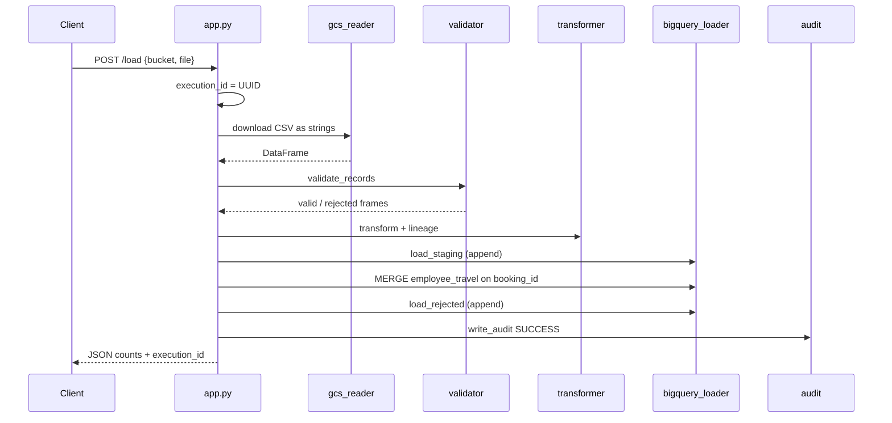
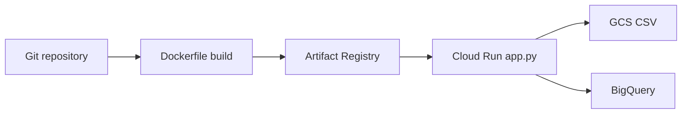

# Codebase guide — folders, files, and flows

How this repository is organized, what each file does, how pieces import each other, and how **data** and **deploy** flows work. Use this while teaching or onboarding.

Related: [../README.md](../README.md), [architecture.md](architecture.md), [teacher-guide.md](teacher-guide.md), [ci-cd.md](ci-cd.md).

---

## Mental model

This is a **small HTTP ETL service**. Almost nothing runs until a client calls `POST /load`.

```text
DATA FLOW (runtime — Python in Cloud Run)
  Client curl
       → app.py + src/
            → GCS  (read dated CSV)
            → pandas validate / transform
            → BigQuery staging → MERGE employee_travel
            → BigQuery rejected + audit

DEPLOY FLOW (not in Python)
  Git  → Docker (Dockerfile) → Artifact Registry → Cloud Run
       (manual --source, or cloudbuild.yaml / GitHub Actions)
```

The Docker image copies **only** `app.py`, `src/`, and `requirements.txt`. CSV and SQL stay outside the container: upload data to GCS and run SQL in BigQuery yourself.

---

## Repository tree

```text
gcp-travel-data-ingestion/
├── app.py                 # HTTP API — the conductor
├── requirements.txt       # Python libraries
├── Dockerfile             # How Cloud Run packages the API
├── .dockerignore          # What NOT to put in the image
├── cloudbuild.yaml        # Automated: build → push → deploy
├── .env.example           # Env var names (no secrets)
│
├── src/                   # ETL steps app.py calls
├── sql/                   # BigQuery dataset / tables / MERGE / checks
├── data/                  # Sample CSVs (uploaded to GCS)
├── scripts/               # Local helpers + data generator
├── .github/workflows/     # Optional GitHub Actions deploy
├── docs/                  # Teaching + architecture
└── images/                # Architecture PNG
```

| Layer | Folders / files | Runs on Cloud Run? |
| --- | --- | --- |
| Runtime | `app.py`, `src/`, `requirements.txt` | Yes |
| Warehouse setup | `sql/` | No — run in BigQuery once |
| Sample data | `data/` | No — upload to GCS |
| Deploy | `Dockerfile`, `cloudbuild.yaml`, `.github/` | Build system / Cloud Build |
| Helpers | `scripts/` | Laptop / Cloud Shell |
| Teaching | `docs/`, `README.md`, `images/` | No |

---

## Runtime: `app.py` + `src/` (how they connect)

`app.py` is the **only** file that talks HTTP. Every ETL module is imported there and called in a fixed order.

```72:116:app.py
    @app.post("/load")
    def load() -> tuple[Any, int]:
        ...
            source = read_csv_from_gcs(bucket, file_name, gcs, execution_logger)
            records_read = len(source)
            valid, rejected = validate_records(source, execution_logger)
            ...
            clean = transform_valid_records(...)
            rejected = transform_rejected_records(...)
            loader = BigQueryLoader(bq, resolved, execution_logger)
            loader.load_staging(clean)
            loader.merge_final(execution_id)
            loader.load_rejected(rejected)
            write_audit(...)
```

### File-by-file

| File | Role | Talks to |
| --- | --- | --- |
| `app.py` | Flask factory: `GET /`, `GET /audit`, `POST /load`. Creates `execution_id` (UUID). Maps errors to HTTP 400/403/404/422/500. | All of `src/`, GCS + BigQuery clients |
| `src/config.py` | Reads **environment only**: `GCP_PROJECT_ID`, `BQ_DATASET`, `BQ_LOCATION`, `PORT`, `LOG_LEVEL`. Builds table IDs `project.travel_analytics.employee_travel`. | `app.py`, loader, audit |
| `src/logger.py` | Stdout logging with `execution_id=` on every line (Cloud Logging). | `app.py` |
| `src/utils.py` | `PipelineError` + HTTP status, UTC timestamps, JSON-safe pandas values. | validator, gcs_reader, app |
| `src/gcs_reader.py` | `blob.download_as_bytes()` → pandas CSV as **all strings**. Maps NotFound → 404, Forbidden → 403, empty/parse → 422. | Cloud Storage |
| `src/validator.py` | Required columns + seven quality rules. Splits **valid** vs **rejected** (`rejection_reason`). In-file duplicate `booking_id`: keep first. | pandas only |
| `src/transformer.py` | Trim; title-case names/cities; uppercase status/currency; `travel_duration_days`; lineage `processed_at`, `source_file`, `execution_id`. Rejected dates/prices stay strings. | pandas only |
| `src/bigquery_loader.py` | Append staging → `MERGE` final on `booking_id` → append rejected. `GET /audit` query. | BigQuery |
| `src/audit.py` | One `insert_rows_json` into `pipeline_audit` (SUCCESS or FAILED). | BigQuery |
| `src/__init__.py` | Marks `src` as a package so `from src.validator import …` works. | — |

Import graph (simplified):

```text
app.py
  ├── config.py
  ├── logger.py
  ├── gcs_reader.py ──► utils.py
  ├── validator.py  ──► utils.py
  ├── transformer.py
  ├── bigquery_loader.py ──► config.py, utils.py
  └── audit.py ──► config.py, utils.py
```

### HTTP contract

| Method | Path | Uses GCP? | What it does |
| --- | --- | --- | --- |
| `GET` | `/` | No | Liveness: `status: UP` |
| `GET` | `/audit` | BigQuery | Latest rows from `pipeline_audit` |
| `POST` | `/load` | GCS + BigQuery | Full pipeline for **one** object |

Load body:

```json
{
  "bucket": "travel-incoming-YOUR_PROJECT_ID",
  "file": "incoming/employee_travel_20260907.csv"
}
```

`file` is **any CSV object path**. Dated names are a convention, not parsed in Python. That string is stored as `source_file` / `pipeline_audit.file_name`.

Success JSON: `status`, `execution_id`, `records_read`, `records_loaded`, `records_rejected`, `processing_time`.

---

## Sample data: `data/`

| Path | Purpose | Typical split |
| --- | --- | --- |
| `data/employee_travel.csv` | Original 1,000-row bulk sample | ~965 valid / 35 rejected |
| `data/incoming/employee_travel_YYYYMMDD.csv` | **Daily drops** (three files in the repo) | 300 rows, **286 / 14** each |

Daily files use **different `booking_id` ranges**, so:

- Loading day 2 after day 1 **adds** ~286 fact rows.
- Replaying the **same** day **does not** add fact rows (MERGE).

These files are **not** baked into Docker. They must exist in GCS (`incoming/…`) before `/load`.

Regenerate: `python scripts/generate_sample_data.py` (`--dates`, `--rows`). Seeded per date so a given day is reproducible.

---

## Warehouse: `sql/`

Run **once** in BigQuery (Console or `bq query`). Python does **not** create tables.

| File | When | What |
| --- | --- | --- |
| `create_dataset.sql` | Setup | Dataset `travel_analytics` (US) |
| `create_tables.sql` | Setup | Four tables, partition, cluster |
| `merge_employee_travel.sql` | Teaching / manual rerun | Same MERGE as `bigquery_loader.py` |
| `validation_queries.sql` | After a load | COUNT, duplicates, rejects, spend, audit |

### Four tables

```text
travel_staging     ──MERGE──►  employee_travel     (analysts; current truth)
                       ▲
                   filter execution_id
travel_rejected                    (quarantine; append)
pipeline_audit                     (ops; one row per API run)
```

| Table | Write pattern | Partition / cluster (see SQL) |
| --- | --- | --- |
| `travel_staging` | Append valid rows for this run | `DATE(processed_at)`, 30-day expiry; cluster `execution_id, booking_id` |
| `employee_travel` | MERGE on `booking_id` | `travel_date`; cluster `department, booking_status, booking_id` |
| `travel_rejected` | Append (invalid values as STRING) | `DATE(rejected_at)` |
| `pipeline_audit` | Streaming insert, one row | `DATE(start_time)` |

`ticket_price` on clean tables is **FLOAT64** so pandas `load_table_from_dataframe` works (NUMERIC + pyarrow is a common failure).

---

## Packaging and CI

| File | Purpose |
| --- | --- |
| `Dockerfile` | Python 3.11-slim, non-root user, gunicorn, `PORT` for Cloud Run |
| `.dockerignore` | Excludes `data/`, `docs/`, `sql/`, `scripts/`, `.github/`, `cloudbuild.yaml` from the image |
| `requirements.txt` | Flask, gunicorn, pandas, google-cloud-storage, google-cloud-bigquery, pyarrow |
| `cloudbuild.yaml` | Cloud Build: docker build → push `travel-platform` → `gcloud run deploy`. Tag `_IMAGE_TAG` (git SHA on triggers, or passed on `gcloud builds submit`) |
| `.github/workflows/deploy.yml` | Optional GitHub Actions: OIDC (Workload Identity) then `gcloud builds submit` — **no JSON key** |
| `.env.example` | Variable **names** only. Production uses Cloud Run env vars; the app does not `load_dotenv()` |

### How deploys connect to the API

```text
Manual (first time):
  gcloud run deploy --source .
       → Cloud Build builds Dockerfile
       → often Artifact Registry cloud-run-source-deploy
       → Cloud Run service travel-ingestion-api

Automated:
  git push  or  gcloud builds submit --config cloudbuild.yaml
       → cloudbuild.yaml
       → Artifact Registry travel-platform
       → new Cloud Run revision (same service, new image)
```

Cloud Run process: `gunicorn … app:app` with env `GCP_PROJECT_ID`, `BQ_DATASET`, `BQ_LOCATION`. Identity = runtime SA `travel-ingestion-sa` (not your user).

---

## Helpers: `scripts/`

| File | Purpose | On the production path? |
| --- | --- | --- |
| `generate_sample_data.py` | Create dated CSVs with intentional defects | No |
| `sample_request.json` | Example `{bucket, file}` for curl | No |
| `test_api.ps1` | Health + load + audit (Windows) | No |
| `deploy.ps1` | git pull → docker build/tag/push → Cloud Run → curl | Optional; Cloud Build is the GCP-native equivalent |

---

## Documentation: `docs/`, `README.md`, `images/`

| File | Audience |
| --- | --- |
| `README.md` | Portfolio: setup, API, interview questions |
| `docs/codebase-guide.md` | This file — repo map and flows |
| `docs/architecture.md` | Data + deploy Mermaid, security |
| `docs/deployment-guide.md` | Console/CLI setup |
| `docs/teacher-guide.md` | Click-by-click classroom script |
| `docs/ci-cd.md` | Cloud Build trigger + GitHub Actions WIF |
| `images/architecture.png` | Diagram for README |

These files are **not** copied into the Cloud Run image.

---

## Data flow: one `POST /load`



Typical daily file: **300** read → **286** loaded → **14** rejected.

On failure, `app.py` still tries to write `pipeline_audit` with `status=FAILED` and `error_message` (truncated to 1024 characters).

### Idempotency

- Staging **always appends**.
- MERGE **updates** existing `booking_id` (lineage columns change).
- Same dated file twice → `employee_travel` **COUNT unchanged**.
- Different day's file → new IDs → COUNT **grows**.
- `travel_rejected` and `pipeline_audit` **always grow** (operational history).

---

## Deploy flow



CI/CD (`cloudbuild.yaml`) is those same three steps (build, push, deploy) run by Cloud Build instead of a human. Image tag `_IMAGE_TAG` should be the git SHA on triggers so revisions are rollbackable.

---

## What to open first (teaching order)

1. `app.py` — `POST /load` is the wiring diagram in code.  
2. `src/validator.py` + `src/transformer.py` — reject vs clean.  
3. `src/bigquery_loader.py` + `sql/merge_employee_travel.sql` — same MERGE, two places.  
4. `sql/create_tables.sql` — why four tables exist.  
5. `Dockerfile` + `cloudbuild.yaml` — how that Python becomes Cloud Run.

---

## Identity (how files relate to IAM)

| Who | Used by | Needs |
| --- | --- | --- |
| Your user / ADC | Local Flask, Console, Cloud Shell | Broad enough to deploy |
| `travel-ingestion-sa` | Cloud Run process (`app.py`) | Storage Object Viewer, BigQuery Data Editor, BigQuery Job User |
| `PROJECT_NUMBER@cloudbuild.gserviceaccount.com` | `cloudbuild.yaml` | Run Admin, Artifact Registry Writer, Service Account User on the runtime SA |

No service-account JSON keys. See [ci-cd.md](ci-cd.md) and [deployment-guide.md](deployment-guide.md).
